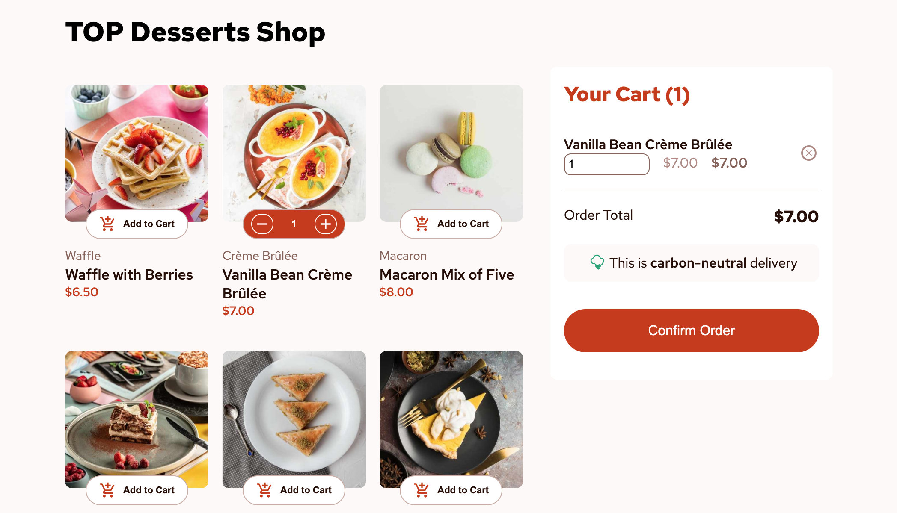

# Frontend Mentor - Product list with cart solution

This is my solution to the [Product list with cart challenge on Frontend Mentor](https://www.frontendmentor.io/challenges/product-list-with-cart-5MmqLVAp_d).

## Table of contents

- [Overview](#overview)
  - [The challenge](#the-challenge)
  - [Screenshot](#screenshot)
  - [Links](#links)
- [My process](#my-process)
  - [Built with](#built-with)
  - [What I learned](#what-i-learned)


## Overview

### The challenge

Users should be able to:

- Add items to the cart and remove them
- Increase/decrease the number of items in the cart
- See an order confirmation modal when they click "Confirm Order"
- Reset their selections when they click "Start New Order"
- View the optimal layout for the interface depending on their device's screen size
- See hover and focus states for all interactive elements on the page

### Screenshot



### Links

- Solution URL: [Add solution URL here](https://your-solution-url.com)
- Live Site URL: [Add live site URL here](https://your-live-site-url.com)

## My process

### Built with

- Semantic HTML5 markup
- CSS custom properties
- Flexbox
- CSS Grid
- Mobile-first workflow
- [React](https://reactjs.org/) - JS library
- [Styled Components](https://styled-components.com/) - For styles

### What I learned
Practiced React.js with implementing React concepts such as: React Routes, Context API, styling with styled-components technique 

/*using props and conditions for styling elements */
div {
    color: ${props => props.count > 0 ? '#fff' : 'hsl(14, 65%, 9%)'};   
}
`

```js
/*changing image based on screen size using:*/
const updateImage = () => {
      if (window.matchMedia("(min-width: 1024px)").matches) {
        setCurrentImage(image.desktop);
      } else if (window.matchMedia("(min-width: 768px)").matches) {
        setCurrentImage(image.tablet);
      } else {
        setCurrentImage(image.mobile);
      }
    };


```
